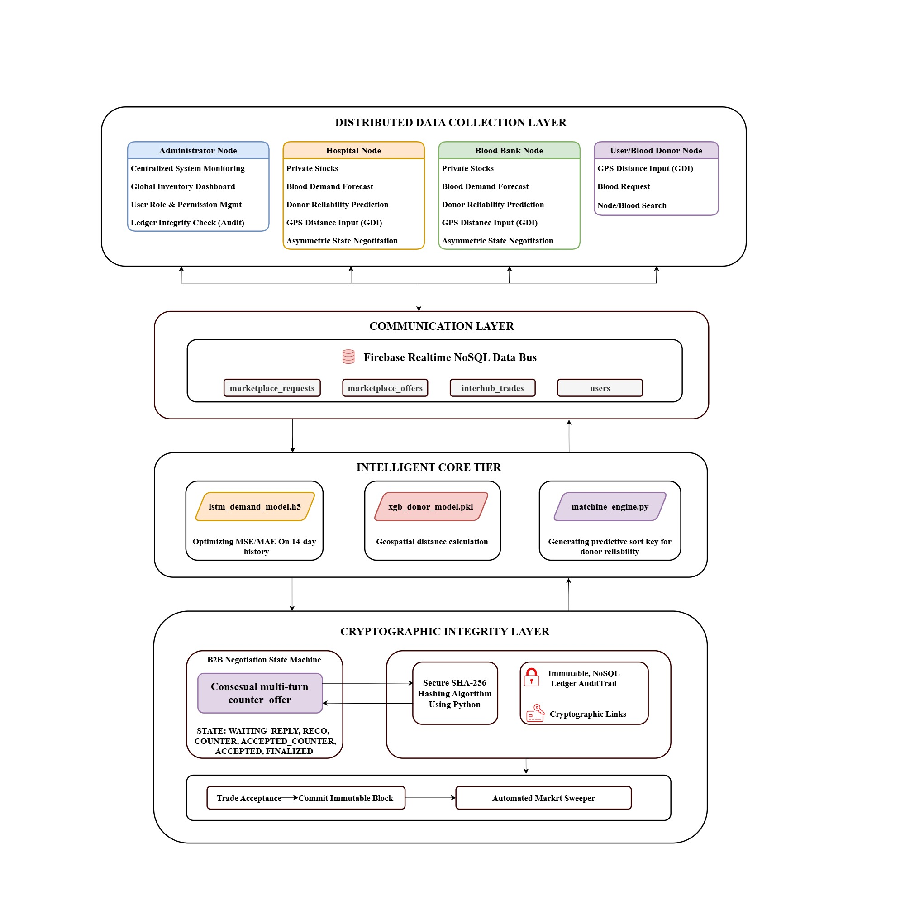
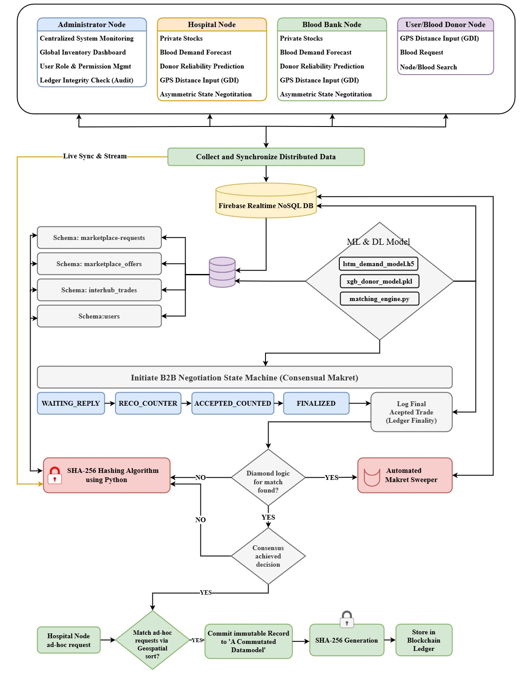
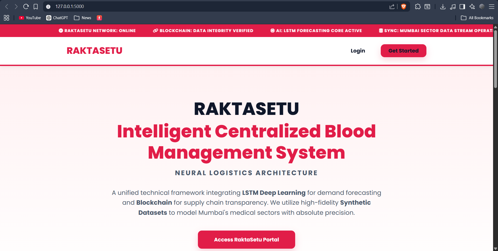
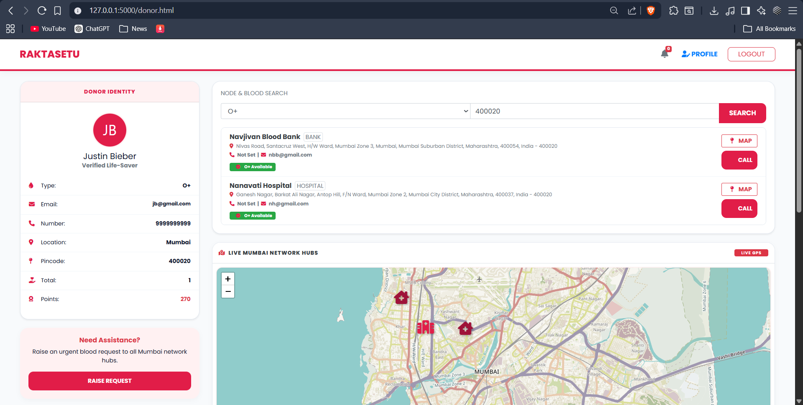
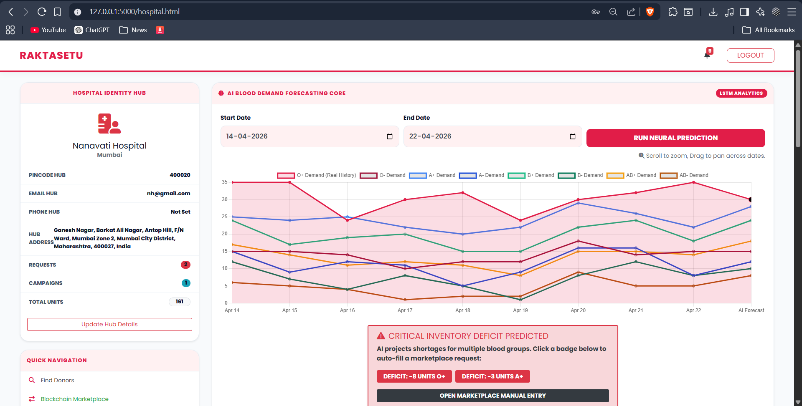
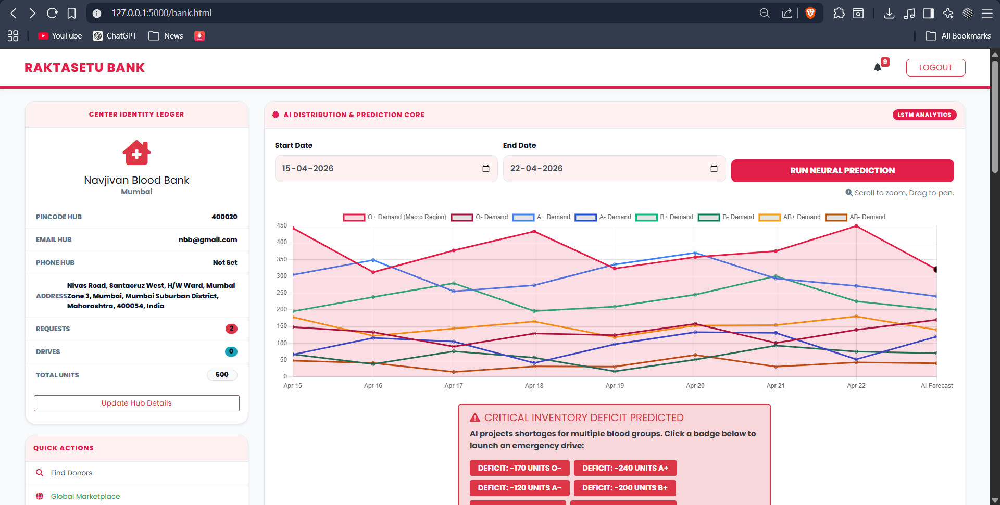
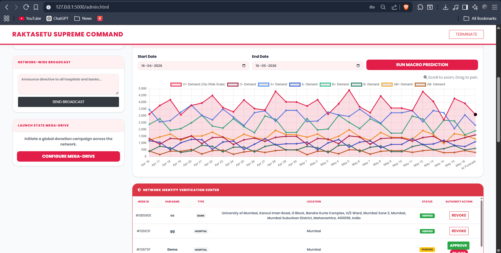
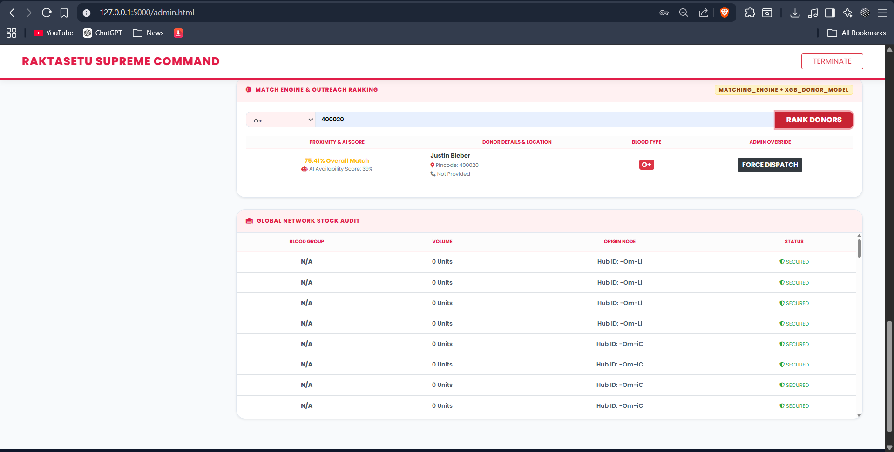

# 🩸 RaktaSetu

### An Intelligent Centralized Blood Management System Integrating Deep Learning and Cryptographic Ledgers

---

## 📌 Overview

RaktaSetu is an AI-powered centralized blood management system designed to optimize blood inventory, improve donor matching, and ensure secure transaction handling across hospitals, blood banks, and donors.

The system integrates **Deep Learning (LSTM)** for demand forecasting, **XGBoost** for donor availability prediction, and a **blockchain-inspired cryptographic ledger** for secure and transparent operations. It transforms traditional reactive systems into a **proactive, data-driven healthcare solution**.

---

## 🚀 Key Features

* 🔮 Blood Demand Forecasting using LSTM
* 👤 Donor Availability Prediction using XGBoost
* ⚡ Intelligent Matching Engine for optimal donor selection
* 🔐 Secure Transaction Logging using SHA-256
* ☁️ Real-time Data Synchronization using Firebase
* 🏥 Multi-user role-based system:

  * Admin
  * Hospital
  * Blood Bank
  * Donor
* 📊 Interactive dashboards and analytics

---

## 🤖 Machine Learning Models

### 🔹 LSTM Model (Demand Forecasting)

* Used for time-series prediction of blood demand
* Captures seasonal trends and fluctuations
* Helps hospitals prepare inventory in advance

<p align="center">
  
</p>

### 🔹 XGBoost Model (Donor Availability Prediction)

* Predicts donor response probability
* Uses features like donation history, behavior, and location
* Enables efficient and fast donor selection during emergencies

<p align="center">
  
</p>
---

### 📊 System Architecture

<p align="center">
  
</p>

--- 
## 🔄 System Workflow

<p align="center">
  
</p>

---

1. User logs into the system (Admin / Hospital / Donor / Blood Bank)
2. Data is stored and synchronized in Firebase Realtime Database
3. LSTM model forecasts future blood demand
4. XGBoost model predicts donor availability
5. Matching engine ranks donors based on:

   * Blood compatibility
   * Geographic proximity
   * Availability probability
   * Reliability score
6. Emergency requests are processed
7. Transactions are secured using SHA-256 hashing
8. Data is updated in real-time across all users

---

## 📸 Application Screenshots

### 🏠 Homepage

<p align="center">
  
</p>

### 👤 User/ Blood Donor Dashboard

<p align="center">
  
</p>

### 🏥 Hospital Dashboard

<p align="center">
  
</p>

### 🩸 Blood Bank Dashboard

<p align="center">
  
</p>

### 🛠️ Admin Dashboard

<p align="center">
  
</p>

### 🔄 Marketplace Module
<p align="center">
  
</p>
---

## 🛠️ Tech Stack

### Backend

* Python
* Flask

### Frontend

* HTML5, CSS3, JavaScript
* Bootstrap

### Machine Learning

* TensorFlow / Keras
* XGBoost
* Scikit-learn

### Database

* Firebase Realtime Database

### Security

* SHA-256 Cryptographic Hashing

---

## 📂 Project Structure

```text
RaktaSetu/
│
├── app.py
├── backend/
│   └── config.py
│
├── frontend/
│   └── firebase-config.js
│
├── templates/
├── static/
│
├── ml_models/
│   ├── lstm_demand_model.h5
│   ├── xgb_donor_model.pkl
│   └── demand_scaler.pkl
│
├── requirements.txt
├── README.md
└── .gitignore
```

---

## ⚙️ Installation & Setup

### 1. Clone Repository

```bash
git clone <your-repo-link>
cd RaktaSetu
```

### 2. Install Dependencies

```bash
pip install -r requirements.txt
```

---

### 3. Configure Firebase

#### Frontend

Update Firebase configuration in:

```
frontend/firebase-config.js
```

Add credentials from Firebase Console → Project Settings.

#### Backend

* Go to Firebase Console → Service Accounts
* Download Service Account Key
* Rename to:

```
serviceAccountKey.json
```

* Place it in project root (DO NOT upload to GitHub)

---

### 4. Setup Environment Variables

Create a `.env` file:

```
SECRET_KEY=your_secret_key
FIREBASE_DB_URL=your_database_url
FIREBASE_CONFIG_PATH=serviceAccountKey.json
```

---

### 5. Train Models (if not included)

* Run ipynb Files is Model not Present , Present inside Model folder

---

### 6. Run Application

```bash
python app.py
```

Open in browser:

```
http://127.0.0.1:5000
```

---

## 📊 Model Performance

### LSTM Demand Forecasting

* MAE: 180.37
* RMSE: 233.2
* R2 Score : 0.7750


### XGBoost Donor Prediction

* MAE: 0.0738
* RMSE: 0.0870
* R2 Score : 0.8250

---

## 📈 Dataset

Synthetic datasets were generated to simulate real-world scenarios:

* Donor Dataset – 250,000 records
* Demand Dataset – 250,000 time-series entries
* Matching Dataset – 15,000 emergency cases

Includes:

* Seasonal demand variations
* Festival and emergency spikes
* Donor behavioral patterns

---

## 🔐 Security Implementation

* SHA-256 hashing used for transaction logging
* Blockchain-inspired ledger architecture
* Ensures:

  * Data integrity
  * Tamper-proof records
  * Transparent audit trails

---

## 📄 Publication

This project has been successfully published in a research journal.

**Title:**
*RaktaSetu: An Intelligent Centralized Blood Management System Integrating Deep Learning and Cryptographic Ledgers using Python*

**Journal:**
International Journal of Engineering Development and Research (IJEDR)

**Status:**
✔ Published

---

## 🏆 Achievements

* Developed a full-stack AI-based healthcare system
* Successfully published research work
* Integrated ML, cloud, and security into one system
* Improved efficiency in blood resource management

---


## 🔮 Future Scope

* CNN-LSTM / Transformer-based forecasting
* Real-time API integration (weather, health alerts)
* IoT-enabled blood storage tracking
* Decentralized blockchain (Hyperledger / Ethereum)
* Smart donor notification system

---

## 👨‍💻 Authors

* Karan Bisht
* Shantanu Chavan
* Satyam Chaurasiya
* Arya Chintawar

---

## 📄 License

This project is developed for academic and research purposes.

---

## ⭐ Final Note

RaktaSetu demonstrates how **Artificial Intelligence, Cloud Computing, and Security** can transform traditional blood bank systems into a **smart, efficient, and life-saving ecosystem**.
